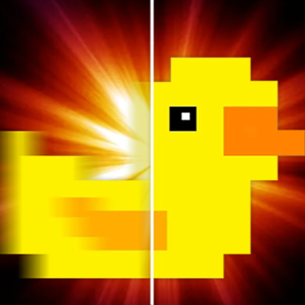

# Lossless Scaling for Steam Deck

   

> **Note:**  
> This is an **unofficial community plugin**. It is independently developed and **not officially supported** by the creators of Lossless Scaling or lsfg-vk. For support, please use the [Decky Lossless Discord Channel](https://discord.gg/TwvHdVucC3).

## What is this?

A Decky plugin that streamlines the installation of **lsfg-vk** ([Lossless Scaling Frame Generation Vulkan layer](https://github.com/PancakeTAS/lsfg-vk)) on Steam Deck, allowing you to use the Lossless Scaling features on Linux with a controller friendly UI in SteamOS or Bazzite. 

## Installation

**Note:** This plugin is currently in active development. While functional, some features may change before the official Decky Plugin Store release.

1. **Download the plugin** from the [latest release](https://github.com/xXJSONDeruloXx/decky-lossless-scaling-vk/releases)
   - Download the "Lossless Scaling.zip" file to your Steam Deck
2. **Install manually through Decky**:
   - In Game Mode, go to the settings cog in the top right of the Decky Loader tab
   - Enable "Developer Mode"
   - Go to "Developer" tab and select "Install Plugin from Zip"
   - Select the downloaded "Lossless Scaling.zip" file

## How to Use

1. **Purchase and install** [Lossless Scaling](https://store.steampowered.com/app/993090/Lossless_Scaling/) from Steam
2. **Open the plugin** from the Decky menu
3. **Click "Install lsfg-vk"** to automatically set up the lsfg-vk vulkan layer
4. **Configure settings** using the plugin's UI - adjust FPS multiplier, flow scale, performance mode, HDR settings, and experimental features
5. **Apply launch option** to games you want to use frame generation with:
   - Add `~/lsfg %command%` to your game's launch options in Steam Properties
   - Or use the "Launch Option Clipboard" button in the plugin to copy the command
6. **Launch your game** - frame generation will activate automatically using your plugin configuration

**Note**: Configuration changes are applied in real-time and will take effect immediately without restarting your game.

## Configuration Options

The plugin provides several configuration options to optimize frame generation for your games:

### Core Settings
- **FPS Multiplier**: Choose between 2x, 3x, or 4x frame generation
- **Flow Scale**: Adjust motion estimation quality (lower = better performance, higher = better quality)
- **Performance Mode**: Uses a lighter processing model - recommended for most games
- **HDR Mode**: Enable for games that support HDR output

### Experimental Features
- **Present Mode Override**: Force specific Vulkan presentation modes for compatibility
- **Base FPS Limit**: Set a base framerate cap before the multiplier is applied (useful for DirectX games)

All settings (except base FPS limit) are saved automatically and can be changed while games are running.

## Feedback and Support

For per-game feedback and community support, please join the [Decky Lossless Discord Channel](https://discord.gg/TwvHdVucC3)

## Troubleshooting

**Frame generation not working?**
- Ensure you've added `LSFG_PROCESS=decky-lsfg-vk %command%` to your game's launch options
- Check that the Lossless Scaling DLL was detected correctly in the plugin
- Try enabling Performance Mode if you're experiencing crashes
- Make sure your game is running in fullscreen mode for best results

**Performance issues?**
- Lower the Flow Scale setting for better performance
- Enable Performance Mode (recommended for most games)
- Try reducing the FPS multiplier from 4x to 2x or 3x
- Consider using the experimental FPS limit feature for DirectX games

## What it does

The plugin:
- Automatically downloads and installs the latest lsfg-vk Vulkan layer to `~/.local/lib/`
- Configures the Vulkan layer in `~/.local/share/vulkan/implicit_layer.d/`
- Creates a TOML configuration file in `~/.config/lsfg-vk/conf.toml` with your settings
- Automatically detects your Lossless Scaling DLL installation
- Provides an easy-to-use interface to configure frame generation settings:
  - **FPS Multiplier**: Choose 2x, 3x, or 4x frame generation
  - **Flow Scale**: Adjust motion estimation quality vs performance
  - **Performance Mode**: Use lighter processing for better performance
  - **HDR Mode**: Enable for HDR-compatible games
  - **Experimental Features**: Override present mode and set FPS limits
- **Hot-reloading**: Configuration changes apply immediately without restarting games
- Easy uninstallation that removes all installed files when no longer needed

## Credits

- **[PancakeTAS](https://github.com/PancakeTAS/lsfg-vk)** for creating the lsfg-vk Vulkan compatibility layer
- **[Lossless Scaling](https://store.steampowered.com/app/993090/Lossless_Scaling/)** developers for the original frame generation technology
- **[Deck Wizard](https://www.youtube.com/@DeckWizard)** for the helpful video tutorial
- The **Decky Loader** team for the plugin framework
- Community contributors and testers for feedback and bug reports
