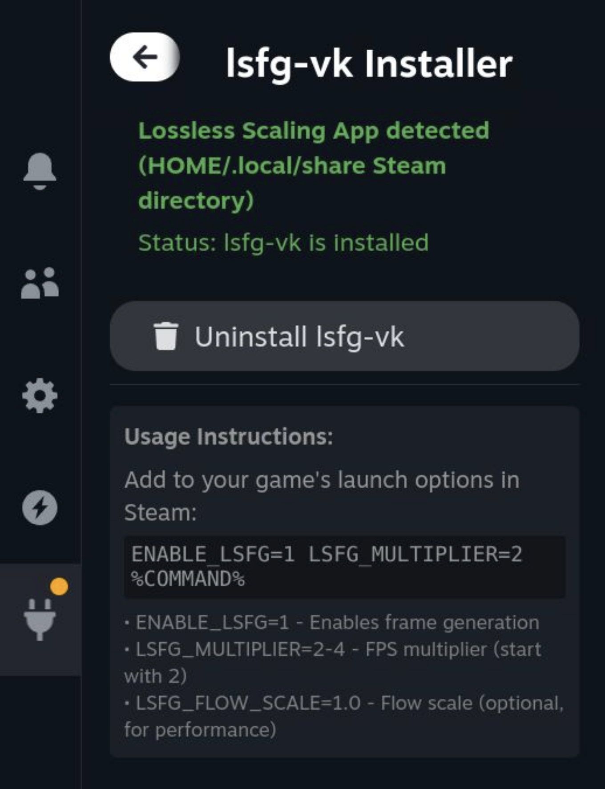

# Lossless Scaling for Steam Deck
A Decky plugin that streamlines the installation of **lsfg-vk** ([Lossless Scaling Frame Generation Vulkan layer](https://github.com/PancakeTAS/lsfg-vk)) on Steam Deck, allowing you to use the Lossless Scaling app on Linux.

## What is this?

This plugin automates the installation of lsfg-vk, a compatibility layer that allows the Windows-only [Lossless Scaling](https://store.steampowered.com/app/993090/Lossless_Scaling/) app to work on Linux systems like Steam Deck. Lossless Scaling provides frame generation and upscaling features for games.

## How to Use

1. **Install the plugin** through the Decky Plugin Store (TBD)
2. **Purchase and install** [Lossless Scaling](https://store.steampowered.com/app/993090/Lossless_Scaling/) from Steam
3. **Open the plugin** from the Decky menu
4. **Click "Install lsfg-vk"** to automatically set up the compatibility layer
5. **Apply launch commands** to the game you want to use frame generation with. The plugin provides a short guide for these commands in its interface.

## What it does

The plugin:
- Extracts the lsfg-vk library to `~/.local/lib/`
- Installs the Vulkan layer configuration to `~/.local/share/vulkan/implicit_layer.d/`
- Provides easy uninstallation by removing these files when no longer needed

## Credits

[PancakeTAS](https://github.com/PancakeTAS/lsfg-vk) for creating the lsfg-vk compatibility layer.